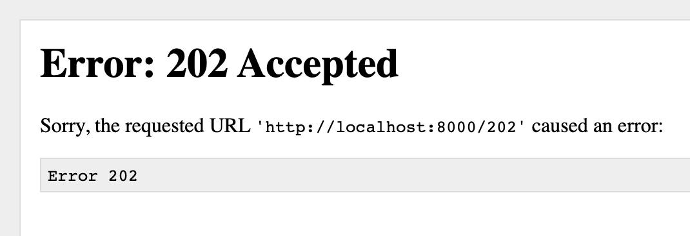
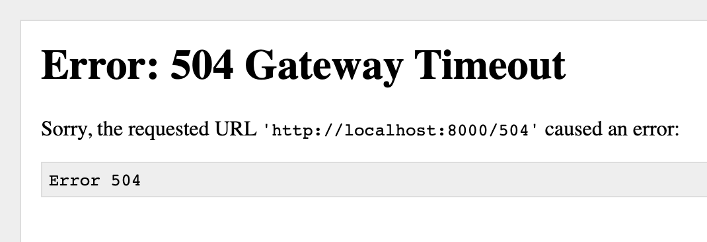

# Docker: HTTP Code Container
Sometimes, it is necessary to do some tests to test: proxy, health check or notification system.

Well, this container can help you in a simple way, passing any HTTP code along the route.

## Quickstart
```sh
$ docker container run -p 8000:8000 argolo/http-code
```

## Examples
```sh
$ open http://localhost:8000/202
```


```sh
$ open http://localhost:8000/504
```


## Author
| [](https://argolo.dev) |
| ------ |
| [André Argôlo](https://argolo.dev) |
